<div align="center">

# 🚀 BOTTIKTOK
### Professional TikTok Video Automation System

[](https://github.com/Jabsama/BOTTIKTOK/actions)
[](https://opensource.org/licenses/MIT)
[](https://hub.docker.com)
[](https://github.com/Jabsama/BOTTIKTOK/security)
[](https://www.python.org/downloads/)

*Enterprise-grade TikTok automation with AI-driven optimization and viral content creation*

[🚀 Quick Start](#-quick-start) • [📖 Documentation](#-documentation) • [🤝 Contributing](#-contributing) • [💬 Community](#-community)

</div>

---

## 🎯 **What is BOTTIKTOK?**

BOTTIKTOK is a **production-ready TikTok automation system** that creates viral content for GPU rental services. Built with enterprise-grade architecture, it combines AI-driven trend analysis, multi-armed bandit optimization, and professional video production to maximize engagement and conversions.

### ✨ **Key Features**

🎬 **Autonomous Content Creation**
- Generates 8-10 second vertical videos with professional effects
- LUT color grading, glow effects, and particle animations
- Multiple video templates (Power/Energy, Speed/Tech, Savings/Action)

🧠 **AI-Driven Optimization**
- ε-greedy multi-armed bandit algorithm for hashtag selection
- Real-time trend analysis and ranking
- Performance-based learning and adaptation

🔄 **Viral Remix System**
- Smart selection of trending videos for compliant remixing
- Automatic creator attribution and copyright compliance
- ≥30% transformation with professional effects

📊 **Enterprise Monitoring**
- Prometheus metrics and Grafana dashboards
- Real-time performance tracking
- Automated alerting and health checks

🔒 **Production Security**
- Automated vulnerability scanning
- Secure credential management
- Rate limiting and compliance controls

---

## 🚀 **Quick Start**

### One-Line Deployment
```bash
docker run -e TZ=UTC -v $(pwd)/project:/app --env-file .env ghcr.io/jabsama/bottiktok:latest
```

### Manual Setup
```bash
# Clone repository
git clone https://github.com/Jabsama/BOTTIKTOK.git
cd BOTTIKTOK

# Setup environment
cp project/.env.example project/.env
# Edit .env with your TikTok API credentials

# Deploy with Docker
docker build -t bottiktok project/
docker run -e TZ=UTC -v $(pwd)/project:/app --env-file project/.env bottiktok
```

### Development Setup
```bash
# Install dependencies
cd project
python -m venv venv
source venv/bin/activate  # Windows: venv\Scripts\activate
pip install -r requirements.txt

# Run tests
pytest tests/ -v --cov=.

# Start development server
python test_video.py --once
```

---

## 📊 **System Architecture**

```mermaid
graph TB
    subgraph "Content Pipeline"
        A[Trend Scraper] --> B[Trend Ranker]
        B --> C[ε-Greedy Bandit]
        C --> D[Script Generator]
        D --> E[Video Builder]
        E --> F[TikTok Uploader]
    end
    
    subgraph "Viral Remix Pipeline"
        VR[Viral Remixer] --> VS[Video Selector]
        VS --> VT[Video Transformer]
        VT --> F
    end
    
    subgraph "Intelligence Layer"
        F --> G[Analytics Scraper]
        G --> C
        ML[Machine Learning] --> C
        ML --> VR
    end
    
    subgraph "Infrastructure"
        H[Scheduler] --> A
        H --> VR
        I[Database] --> B
        I --> C
        I --> G
        J[Monitoring] --> K[Alerts]
    end
    
    style A fill:#e1f5fe
    style E fill:#f3e5f5
    style F fill:#e8f5e8
    style G fill:#fff3e0
```



---

## 🎬 **Content Strategy**

### **Original Content Creation**
- **Trend Analysis**: Real-time scraping of TikTok trending hashtags
- **Smart Selection**: ε-greedy bandit algorithm optimizes hashtag performance
- **Professional Production**: LUT color grading, glow effects, smooth transitions
- **Brand Integration**: Consistent promo code placement and affiliate links

### **Viral Remix System**
- **Intelligent Selection**: Analyzes top 100 fastest-growing videos
- **Compliance First**: Automatic creator attribution and fair use compliance
- **Professional Transformation**: ≥30% content modification with effects
- **Performance Tracking**: Monitors remix performance vs. original content

### **Video Templates**

| Template | Style | Best For | Effects |
|----------|-------|----------|---------|
| **Power/Energy** | Dynamic zoom, lightning | Gaming, Performance | Particle bursts, flash effects |
| **Speed/Tech** | Motion blur, glitch | AI, Cloud computing | Digital overlays, speed lines |
| **Savings/Action** | Coin drops, price slash | Budget, Discounts | CTA emphasis, flash animations |

---

## 📈 **Performance Metrics**

### **Optimization Algorithm**
- **Exploration Rate**: 10% (configurable)
- **Reward Function**: `(views × engagement_rate) + (CTR × conversion_weight)`
- **Learning Rate**: Adaptive based on confidence intervals
- **Performance Tracking**: Real-time bandit arm performance

### **Content Specifications**
- **Format**: Vertical 1080×1920 (TikTok optimized)
- **Duration**: 8-10 seconds (optimal engagement)
- **Text Limit**: ≤4 words (mobile-friendly)
- **Effects**: Professional LUT grading + glow + particles
- **Compliance**: Mandatory disclaimers and AI labels

---

## 🔧 **Configuration**

### **Environment Variables**
```bash
# TikTok API (Required)
TIKTOK_CLIENT_KEY=your_client_key
TIKTOK_CLIENT_SECRET=your_client_secret
TIKTOK_ACCESS_TOKEN=your_access_token

# Multi-Platform (Optional)
YT_CLIENT_ID=your_youtube_client_id
IG_USER_ID=your_instagram_user_id

# Monitoring (Optional)
DISCORD_WEBHOOK_URL=your_discord_webhook
PROMETHEUS_ENABLED=true
```

### **Brand Customization**
```yaml
# config.yaml
brand:
  hex_primary: "#00BFA6"      # Your primary color
  hex_secondary: "#FFD54F"    # Your secondary color
  promo_code: "SHA-256-76360B81D39F"  # Your affiliate code

posting:
  max_posts_per_day: 6        # TikTok compliance
  min_spacing_minutes: 90     # Anti-spam protection
```

---

## 🚀 **Deployment Options**

### **Cloud Platforms**

| Platform | Instance Type | Monthly Cost | Setup Time |
|----------|---------------|--------------|------------|
| **Oracle Cloud** | VM.Standard.E2.1.Micro | Free | 5 minutes |
| **AWS EC2** | t2.micro | Free tier | 10 minutes |
| **Google Cloud** | e2-micro | Free tier | 10 minutes |
| **DigitalOcean** | Basic Droplet | $5/month | 5 minutes |

### **Docker Deployment**
```bash
# Production deployment
docker-compose -f docker-compose.prod.yml up -d

# Development deployment
docker-compose up -d

# Monitoring stack
docker-compose -f docker-compose.monitoring.yml up -d
```

---

## 📊 **Monitoring & Analytics**

### **Built-in Metrics**
- 📈 **Video Performance**: Views, likes, shares, comments
- 🎯 **Conversion Tracking**: Promo code usage and affiliate clicks
- 🤖 **System Health**: Upload success rate, API response times
- 💰 **ROI Analysis**: Cost per engagement, revenue attribution

### **Dashboards**
- **Grafana**: Real-time performance monitoring
- **Prometheus**: Metrics collection and alerting
- **Custom Analytics**: TikTok studio integration

---

## 🔒 **Security & Compliance**

### **Built-in Security**
- ✅ **Vulnerability Scanning**: Automated security checks
- ✅ **Credential Management**: Secure environment variable handling
- ✅ **Rate Limiting**: TikTok API compliance and anti-spam
- ✅ **Data Protection**: Minimal data collection and secure storage

### **Legal Compliance**
- ✅ **Copyright Compliance**: Automatic creator attribution
- ✅ **Platform ToS**: Built-in TikTok terms compliance
- ✅ **Advertising Laws**: Proper affiliate disclosure
- ✅ **AI Transparency**: Mandatory "AI generated" labels

---

## 📖 **Documentation**

| Document | Description |
|----------|-------------|
| [📋 **CONTRIBUTING.md**](CONTRIBUTING.md) | Contribution guidelines and development setup |
| [🚀 **DEPLOYMENT.md**](DEPLOYMENT.md) | Production deployment and cloud setup |
| [⚖️ **LEGAL.md**](LEGAL.md) | Legal compliance and copyright guidelines |
| [📄 **LICENSE**](LICENSE) | MIT license terms and conditions |

---

## 🤝 **Contributing**

We welcome contributions from the community! Here's how to get started:

### **Quick Contribution**
1. 🍴 Fork the repository
2. 🌿 Create a feature branch (`git checkout -b feature/amazing-feature`)
3. ✅ Run tests (`pytest tests/ -v`)
4. 📝 Commit changes (`git commit -m 'Add amazing feature'`)
5. 🚀 Push to branch (`git push origin feature/amazing-feature`)
6. 🔄 Open a Pull Request

### **Development Setup**
```bash
# Install development dependencies
pip install pytest ruff black isort pytest-cov

# Run quality checks
ruff check .          # Linting
black .               # Formatting
isort .               # Import sorting
pytest tests/ -v      # Testing
```

### **Community Assets**
We're building a community asset library! Contribute:
- 🖼️ **Background Images**: Tech, gaming, AI themes (CC0 license)
- 🎨 **Overlay Elements**: Particles, icons, effects (PNG format)
- 🎵 **Audio Tracks**: Royalty-free background music
- 📝 **Templates**: New video templates and styles

---

## 💬 **Community**

### **Get Help**
- 🐛 **Bug Reports**: [Create an issue](https://github.com/Jabsama/BOTTIKTOK/issues/new?template=bug_report.md)
- 💡 **Feature Requests**: [Request a feature](https://github.com/Jabsama/BOTTIKTOK/issues/new?template=feature_request.md)
- 💬 **Discussions**: [GitHub Discussions](https://github.com/Jabsama/BOTTIKTOK/discussions)
- 📧 **Security Issues**: security@bottiktok.com

### **Stay Updated**
- ⭐ **Star this repo** to stay updated
- 👀 **Watch releases** for new features
- 🐦 **Follow us** for updates and tips

---

## 📊 **Project Stats**

<div align="center">


</div>

---

## 🏆 **Success Stories**

> *"BOTTIKTOK helped us achieve 10x engagement growth and 300% increase in GPU rental conversions within the first month."*
> 
> — **Tech Startup CEO**

> *"The viral remix feature is genius. We're getting millions of views by riding trending content waves."*
> 
> — **Digital Marketing Agency**

> *"Professional-grade automation that actually works. The compliance features saved us from legal headaches."*
> 
> — **Enterprise Customer**

---

## 🎯 **Roadmap**

### **Q1 2024**
- [ ] YouTube Shorts integration
- [ ] Instagram Reels support
- [ ] Advanced AI voice generation
- [ ] Real-time trend prediction

### **Q2 2024**
- [ ] Mobile app companion
- [ ] Advanced analytics dashboard
- [ ] Multi-language support
- [ ] Enterprise SSO integration

### **Q3 2024**
- [ ] AI-powered script generation
- [ ] Advanced video effects library
- [ ] Collaborative team features
- [ ] White-label solutions

---

## 📄 **License**

This project is licensed under the MIT License - see the [LICENSE](LICENSE) file for details.

**Commercial use is explicitly allowed and encouraged!**

---

<div align="center">

### 🚀 **Ready to Go Viral?**

**[Get Started Now](https://github.com/Jabsama/BOTTIKTOK/archive/refs/heads/main.zip)** • **[View Documentation](project/README.md)** • **[Join Community](https://github.com/Jabsama/BOTTIKTOK/discussions)**

---

**Built with ❤️ for the GPU rental community**

*Helping creators and businesses harness the power of automated content marketing*

**⭐ Star this repo if you found it helpful!**

</div>
