# TikTok Video Automation System

A fully automated TikTok video creation and posting system that generates viral content for GPU rental services. Uses AI-driven trend analysis, multi-armed bandits for optimization, and professional video production.

## 🚀 Features

- **Autonomous Content Creation**: Generates 8-10 second vertical videos with professional effects
- **Trend Analysis**: Scrapes and ranks trending hashtags using ε-greedy bandit algorithm
- **Smart Optimization**: Machine learning-driven hashtag selection based on performance
- **Professional Video Effects**: LUT color grading, glow effects, particle animations
- **Rate Limiting**: Respects TikTok's posting limits (≤6 posts/day, ≥90min spacing)
- **Compliance**: Includes mandatory disclaimers and "AI generated" labels
- **Analytics Tracking**: Monitors video performance and optimizes strategy

## 📋 Requirements

- **System**: Ubuntu 22.04 LTS (4GB RAM minimum)
- **Python**: 3.8+
- **FFmpeg**: For video processing and LUT application
- **Chrome**: For web scraping (headless)

## 🛠️ Installation

### 1. System Dependencies

```bash
# Update system
sudo apt update && sudo apt upgrade -y

# Install Python and pip
sudo apt install python3 python3-pip python3-venv -y

# Install FFmpeg
sudo apt install ffmpeg -y

# Install Chrome for Selenium
wget -q -O - https://dl.google.com/linux/linux_signing_key.pub | sudo apt-key add -
echo "deb [arch=amd64] http://dl.google.com/linux/chrome/deb/ stable main" | sudo tee /etc/apt/sources.list.d/google-chrome.list
sudo apt update
sudo apt install google-chrome-stable -y
```

### 2. Project Setup

```bash
# Clone or download project
cd /home/ubuntu
git clone <repository-url> project
cd project

# Create virtual environment
python3 -m venv venv
source venv/bin/activate

# Install Python dependencies
pip install -r requirements.txt
```

### 3. Configuration

Create `.env` file with your credentials:

```bash
# TikTok API Credentials
TIKTOK_CLIENT_KEY=your_client_key
TIKTOK_CLIENT_SECRET=your_client_secret
TIKTOK_ACCESS_TOKEN=your_access_token

# TikTok Studio Credentials (for analytics)
TIKTOK_USERNAME=your_username
TIKTOK_PASSWORD=your_password

# Optional: Discord webhook for notifications
DISCORD_WEBHOOK_URL=your_webhook_url
```

### 4. Asset Setup

```bash
# Create asset directories
mkdir -p assets/bg assets/overlays output logs backups

# Add your background images/videos to assets/bg/
# Add overlay elements to assets/overlays/
```

## 🎯 Configuration

Edit `config.yaml` to customize your brand:

```yaml
brand:
  hex_primary: "#00BFA6"      # Your primary color
  hex_secondary: "#FFD54F"    # Your secondary color
  promo_code: "GPU5"          # Your promo code

posting:
  max_posts_per_day: 6        # Stay within TikTok limits
  min_spacing_minutes: 90     # Minimum time between posts
```

## 🚀 Usage

### One-Liner Docker Deployment

```bash
# Quick start with Docker (recommended)
docker run -e TZ=UTC -v $(pwd)/project:/app voltage-bot ./scheduler.sh
```

### Manual Execution

```bash
# Run complete pipeline once
./scheduler.sh

# Test individual components
python scraper_trends.py
python ranker.py
python bandit.py
python build_prompt.py
python build_video.py --once
```

### Automated Scheduling

Set up cron job for automated posting:

```bash
# Edit crontab
crontab -e

# Add these lines for automated posting:
# Every 3 hours during peak times (9 AM - 9 PM)
0 9,12,15,18,21 * * * /home/ubuntu/project/scheduler.sh

# Daily cleanup at 2 AM
0 2 * * * /home/ubuntu/project/scheduler.sh cleanup

# Weekly backup on Sundays at 1 AM
0 1 * * 0 /home/ubuntu/project/scheduler.sh backup
```

## 📊 System Architecture

```mermaid
graph TD
    A[Trend Scraper] --> B[Trend Ranker]
    B --> C[ε-Greedy Bandit]
    C --> D[Script Generator]
    D --> E[Video Builder]
    E --> F[TikTok Uploader]
    F --> G[Analytics Scraper]
    G --> C
    
    VR[Viral Remixer] --> VS[Video Selector]
    VS --> VT[Video Transformer]
    VT --> F
    
    H[Scheduler] --> A
    H --> VR
    I[Database] --> B
    I --> C
    I --> G
    I --> VR
    
    J[Assets] --> E
    K[LUT Files] --> E
    L[Config] --> E
    
    M[CI/CD Pipeline] --> N[Docker Build]
    N --> O[Security Scan]
    O --> P[Release]
```



## 🎬 Video Templates

### Template A: Power/Energy
- Dynamic zoom effects
- Lightning flashes
- Particle burst animations
- Best for: Performance, gaming content

### Template B: Speed/Tech
- Motion blur effects
- Digital glitch overlays
- Quick cuts
- Best for: AI, cloud computing

### Template C: Savings/Action
- Coin drop effects
- Price slash animations
- Strong call-to-action
- Best for: Budget, discount content

## 📈 Performance Optimization

### Bandit Algorithm
- **Exploration Rate**: 10% (adjustable)
- **Reward Function**: Views × engagement rate
- **Learning**: Adapts based on video performance

### Content Strategy
- **≤4 words**: Maximum text for mobile viewing
- **8-10 seconds**: Optimal duration for engagement
- **Vertical format**: 1080×1920 for TikTok
- **Brand consistency**: Colors and promo code in every video

## 🔧 Troubleshooting

### Common Issues

**Video creation fails:**
```bash
# Check FFmpeg installation
ffmpeg -version

# Verify asset directories
ls -la assets/

# Test video creation
python test_video.py --once
```

**Upload fails:**
```bash
# Check API credentials
echo $TIKTOK_ACCESS_TOKEN

# Verify rate limits
python -c "from upload import TikTokUploader; u=TikTokUploader(); print(u.can_upload_now())"

# Test with retry mechanism
python -c "from tenacity import retry; print('Retry mechanism available')"
```

**Trend scraping fails:**
```bash
# Check internet connection
curl -I https://www.tiktok.com

# Verify Chrome installation
google-chrome --version

# Test viral remix system
python -c "from viral_remix import ViralRemixer; r=ViralRemixer(); print('Remix system OK')"
```

**Docker issues:**
```bash
# Build and test Docker image
docker build -t tiktok-bot .
docker run --rm tiktok-bot python -c "import yaml; print('Dependencies OK')"

# Check image size
docker images tiktok-bot --format "table {{.Repository}}\t{{.Tag}}\t{{.Size}}"
```

### Log Files

- **Main logs**: `/home/ubuntu/project/logs/scheduler.log`
- **Error logs**: `/home/ubuntu/project/logs/error.log`
- **Database**: `/home/ubuntu/project/trends.db`

## 📊 Analytics & Monitoring

### Performance Metrics
- **Views**: Primary success metric
- **Engagement Rate**: Likes + shares + comments / views
- **CTR**: Click-through rate to your service
- **Conversion**: Promo code usage tracking

### Monitoring Commands
```bash
# Check upload statistics
python -c "from upload import TikTokUploader; u=TikTokUploader(); print(u.get_upload_statistics())"

# View bandit performance
python -c "from bandit import TrendBandit; b=TrendBandit(); print(b.get_bandit_statistics())"

# Analytics summary
python analytics_scraper.py
```

## 🔒 Compliance & Safety

### Mandatory Elements
- ✅ "AI generated" label on all videos
- ✅ "⚠ Results may vary" disclaimer
- ✅ No guaranteed income claims
- ✅ Proper affiliate disclosure
- ✅ Rate limiting to prevent spam

### Content Guidelines
- Focus on technology and performance
- Avoid misleading claims
- Include clear pricing information
- Respect TikTok community guidelines

## 🚀 Deployment Options

### Oracle Cloud Free Tier
```bash
# Create VM instance
# Shape: VM.Standard.E2.1.Micro (1 OCPU, 1GB RAM)
# OS: Ubuntu 22.04
# Storage: 47GB boot volume

# Configure firewall (if needed)
sudo ufw allow 22
sudo ufw enable
```

### AWS EC2 Free Tier
```bash
# Instance type: t2.micro
# AMI: Ubuntu Server 22.04 LTS
# Storage: 30GB gp2
```

## 📝 Development

### Adding New Templates
1. Create template function in `build_video.py`
2. Add to `templates` list
3. Test with `python build_video.py`

### Custom Trend Sources
1. Add scraping method to `scraper_trends.py`
2. Update `scrape_trending_hashtags()` method
3. Test with `python scraper_trends.py`

### New Video Effects
1. Add effect function to `build_video.py`
2. Include in template composition
3. Test rendering performance

## 🏗️ Development and Contributing

### Code Quality


### Running Tests
```bash
# Install development dependencies
pip install pytest ruff black isort pytest-cov

# Run linting
ruff check .
black --check .
isort --check-only .

# Run tests with coverage
pytest tests/ -v --cov=. --cov-report=term-missing
```

### Contributing Guidelines
1. Fork the repository
2. Create feature branch (`git checkout -b feature/amazing-feature`)
3. Write tests for new functionality
4. Ensure all tests pass and code is properly formatted
5. Commit changes (`git commit -m 'Add amazing feature'`)
6. Push to branch (`git push origin feature/amazing-feature`)
7. Open Pull Request

### Community Assets
We welcome community contributions of background images and overlay assets!

**Asset Contribution Guidelines:**
- **License**: All assets must be CC0 (public domain) or original work
- **Quality**: High resolution (1080p+ for backgrounds)
- **Format**: PNG for overlays, JPG/PNG/MP4 for backgrounds
- **Content**: Professional, brand-safe content related to tech/gaming/AI
- **Submission**: Create PR with assets in `community-assets/` folder

## 📄 License

This project is open source under the MIT License. See `LICENSE` file for details.

**License Summary:**
- ✅ Commercial use allowed
- ✅ Modification allowed
- ✅ Distribution allowed
- ✅ Private use allowed
- ❗ License and copyright notice required
- ❗ No warranty provided

## ⚠️ Legal and Compliance

**Important**: Read `LEGAL.md` for comprehensive legal guidelines.

This tool is for educational and legitimate business purposes only. Users are responsible for:
- Complying with TikTok's Terms of Service and Community Guidelines
- Following local advertising and copyright regulations
- Ensuring content accuracy and truthfulness
- Respecting intellectual property rights of others
- Proper business registration and tax compliance for commercial use

**Viral Remix Compliance:**
- Original creators are automatically credited
- ≥30% transformation applied when required
- Copyright detection and handling included
- Fair use considerations documented

## 📞 Support and Community

### Getting Help
1. **Documentation**: Check this README and `LEGAL.md`
2. **Troubleshooting**: Review the troubleshooting section above
3. **Logs**: Check `logs/scheduler.log` for error details
4. **Issues**: Open an issue on GitHub with detailed information
5. **Discussions**: Use GitHub Discussions for questions and ideas

### Monitoring and Observability
- **Prometheus Metrics**: Built-in metrics export for monitoring
- **Grafana Dashboards**: Compatible with Grafana Cloud free tier
- **Health Checks**: Docker health checks included
- **Log Aggregation**: Structured logging for easy analysis

### Security
- **Vulnerability Scanning**: Automated security scans in CI/CD
- **Dependency Updates**: Automated dependency vulnerability checks
- **Secure Defaults**: Secure configuration defaults
- **Credential Management**: Proper environment variable handling

---

**Built with ❤️ for the GPU rental community**

*Remember: Success in content marketing comes from providing genuine value to your audience. Use this tool responsibly and focus on helping people find the computing resources they need.*

**🚀 Ready to get started? Copy `.env.example` to `.env`, fill in your credentials, and run `docker run -e TZ=UTC -v $(pwd)/project:/app voltage-bot ./scheduler.sh`**
